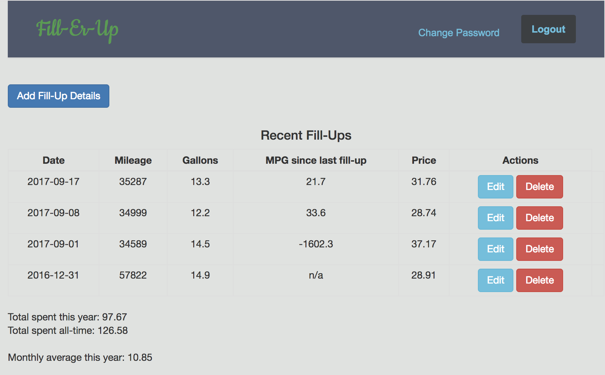

# Fill-Er Up - An app for tracking fuel purchases

Users enter the date, mileage, gallons purchased, and price when they put fuel in their car.  The app calculates & displays MPG since last fill-up, amount spent on gas since the first entry, amount spent in the current year, and monthly average in current year.

### [Live App](https://mgnieman.github.io/fill-ups-client/) | [Deployed API](https://fill-ups.herokuapp.com/) | [API Repository](https://github.com/mgnieman/fill-ups-api)

## Technologies

- HTML
- CSS/SASS
- Bootstrap
- Javascript
- jQuery
- AJAX
- Handlebars
- Rails
- Heroku
- Github Pages

## Planning, Process & Problem-Solving

The idea came from the project prompt, which suggested tracking car repairs.  I decided to do something slightly different because it occurred to me that mileage, gallons & price would provide the opportunity to do calculations based on user-entered data; which is something I wanted to do with project 2 but did not get to.

I started by writing user stories, then a wireframe, and then an ERD.  Then I downloaded the browser template and the API template.

Another of my goals for this project was to use a navbar and modals for sign-up, sign-in, etc.  The first thing I built was the navbar and the links for the auth stuff.  Then I ran curl scripts on the auth stuff, then built the modals, then got authentication working on the front-end.  Next I created my resource in the API and tested it with curl scripts before moving to the front-end and making it all display on the page.  The most time consuming part of getting the basics to work was figuring out what/when to show/hide at certain times.

Once I got the table, add form & edit form to display I started using that data to make calculations.  All of this was done in the 'ui.js' file.  I did some slight re-factoring as I went, pulling lines out of large functions and using them to create smaller functions that get invoked in the function they were pulled out of.  Keeping up with this makes it much easier to read and to figure out what is happening.

I can't begin to count how many times I typed 'console.log' throughout the course of this project.  That, in a nut-shell, was my problem-solving process.  If the console logged 'undefined' I would log something a level higher (i.e. if data.fill_ups was undefined, I'd log data).  That worked well most of the time.  Once I know what I'm working with, it's much easier to make happen what I want to happen.

### User Stories
- As a car owner, I would like to enter my current mileage so that I can use this as a baseline for the frequency of other events.
- As a car owner, I would like to enter the number of gallons of gas each time I fill up so that I can track miles driven between each fill up.
- As a car owner, I would like to enter the total spent on gas each time I fill up so that I can track how much I spend on gas.

* Reach User Stories:
* As a car owner, I would like to view MPG between fill ups so that I can monitor my car’s performance.
* As a fiscally responsible car owner, I would like to view the total amount I’ve spent on gas this year so that I can fit it into my budget.

### Wireframes

- [Wireframe](https://imgur.com/a/0cWVI)

### Goals for Future Versions
- Options for average monthly amount spent - all-time, last 2 years
- Limit the number of fill-ups that display per page & implement a page-scroll to see the others
- More specific calculation for monthy average; currently using (current month - 1)
- Friendlier handling of invalid date, gallons & price entries
- Add zeros to all price entries (i.e. 56 -> 56.00)
- Delete-confirmation pop-up
- Style add & edit forms so that the fields are aligned
